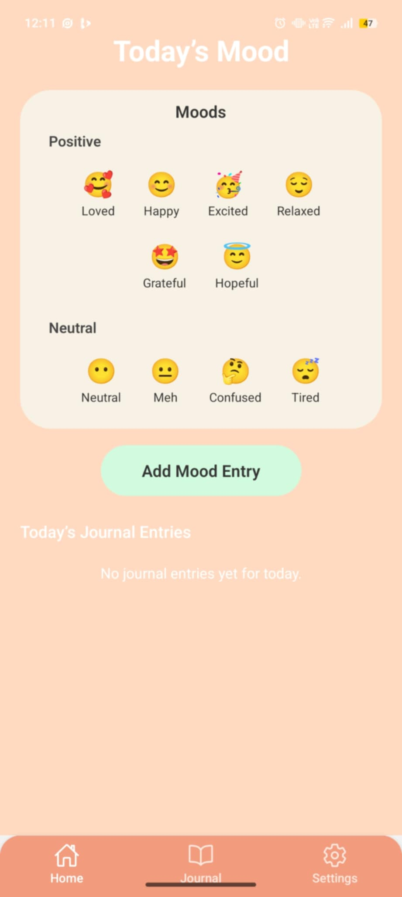
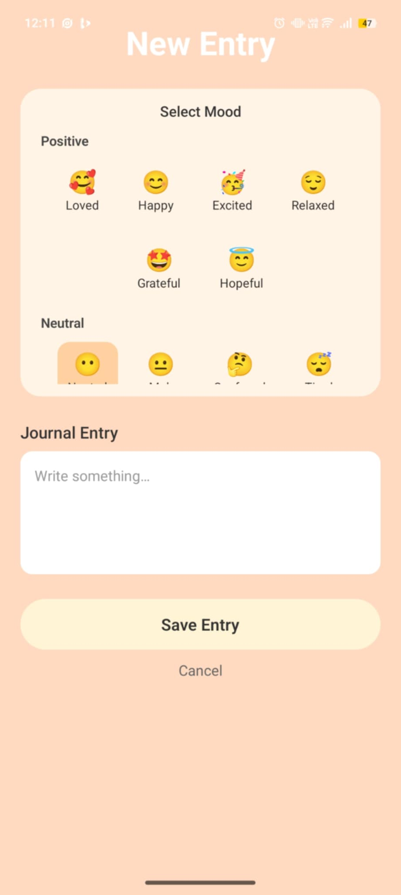
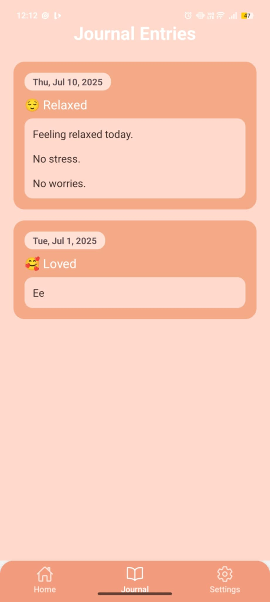
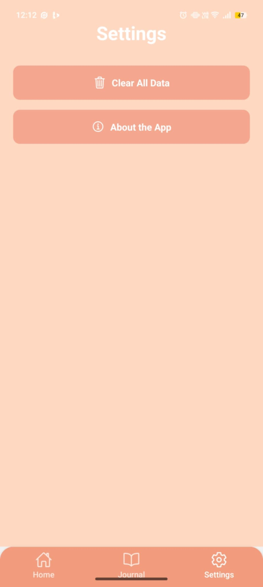

# MindMate - Mood Journal & Mental Health Tracker

**MindMate** is a student-developed mobile application that helps users reflect on their emotions, write personal journal entries, and track their emotional well-being over time - all while keeping their data 100% private on their device.

---

## Purpose

Many people can't afford therapy or don't have access to mental health tools.
MindMate provides a safe space to release thoughts, reflect daily, and see emotional patterns, even offline.

---

## Features

** Mood Tracking **
Select a mood using emojis categorized into Positive, Neutral, and Negative.
Entries are stored and time-stamped for the day.

** Journaling **
Write private journal entries connected to each mood. View, edit, or delete them anytime.

** Journal History **
View and access past entries by date, moodm and text snippet.

** Offline & Private **
All data is saved locally AsynStorage - no aacounts, no cloud, no tracking.

** Settings & About **
Clear all data easily and view app information in a dedicated screen.

## Built With

** React Native ** (via Expo)
** JavaScript **
** React Navigation **
** AsnycStorage ** - for offline storage
** Vector Icons ** - for UI enhancements

---

## Screenshots (Coming Soon)

---

## Privacy

MindMate does **not collect** any personal data.
All journal entries are stored **only on the user's device**, and users can clear all entries at any time from the Settings screen.

---

## Planned Improvements

- Mood History analytics (charts and trends)
- Data export to PDF or CSV
- Daily reminder notifications
- Optional pin/password lock for added privacy

---

## Creator

Developed by a student passionate about combining mental health awareness and mobile technology.
This app is part of my personal and academic project portfolio.

---

## Version

- **Version:** 1.1.1
- **Platfomr Compatibility:** Android · Expo Go · Web (via Expo)
